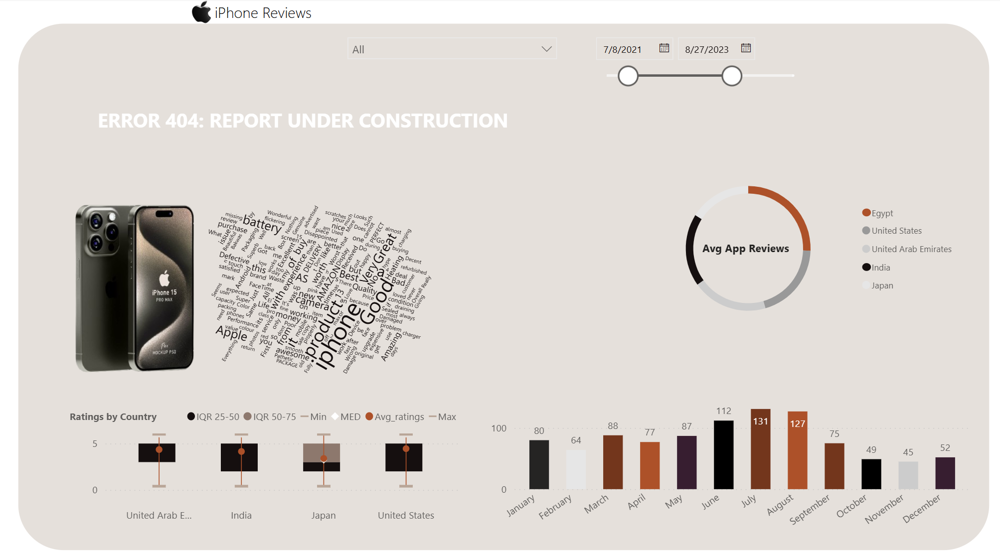

# 📱 Apple iPhone Reviews Analysis

This project focuses on analyzing user reviews of Apple iPhones across different countries, providing insights into user sentiment, feature satisfaction, and discussion themes.

---

## 🔍 Project Objectives

### 1. **Sentiment Analysis**
- Use natural language processing to determine the overall sentiment (positive, negative, neutral) of reviews.
- Track sentiment trends across time and regions.

### 2. **Feature Analysis**
- Assess user satisfaction with key iPhone features like battery life, camera, performance, design, etc.
- Identify commonly praised or criticized features.

### 3. **Topic Modeling**
- Apply techniques like LDA to uncover prevalent themes and recurring topics in the reviews.

### 4. **Visualizations**
- Interactive charts and dashboards to explore:
  - Ratings distribution by country.
  - Average review trends by month.
  - Word clouds and sentiment distributions.
  - Topic clusters and feature feedback.

---

## 📊 Data & Tools
- **Data Source**: iPhone app store and online product reviews.
- **Tools**: Python (Pandas, NLTK/spaCy, Gensim, Matplotlib, Seaborn, Plotly), Power BI/Tableau for visualizations.

---

## 🚧 Current Status
> **ERROR 404: REPORT UNDER CONSTRUCTION**  
Dashboard development and model training are in progress. More updates to come!

## 🤝 Connect with Me

🔗 [LinkedIn Profile](https://www.linkedin.com/in/damiondaley)
---

## 📁 Repository Structure

project-root/
│
├── data/ # Raw and processed data
├── notebooks/ # Jupyter notebooks with EDA, modeling
├── models/ # Trained model files
├── resources/
│ └── image/
│ └── c36bcdcd-5555-4101-8de5-7d8762eaa907.png # Dashboard screenshot
├── outputs/ # Visualizations and reports
└── README.md